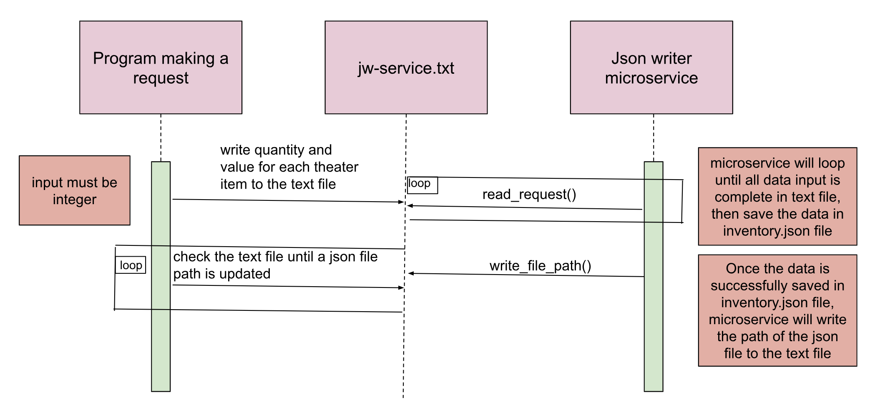

# Json Writer Microservice

## Description 
The Json Writer microservice gets quantity and value data from user to update inventory for a theater. It uses jw-service.txt as communication pipe. It saves the data in json format and writes it in inventory.json file.

## How to request data
* Run json_writer.py first
* In a separate terminal, run the ui program (test_json_writer.py) to gather user input and write the request into jw-service.txt 

## How to receive data
* The json_writer.py reads request from jw-service.txt and responds by generating or updating the inventory.json.
* Once the inventory.json file is ready, the microservice sends a confirmation back to jw-service.txt
* When the ui(test_json_writer.py) receives the confirmation from jw-service.txt, it prints a message in the CLI informing user to access the data in the inventory.json file.

## UML sequence diagram 
